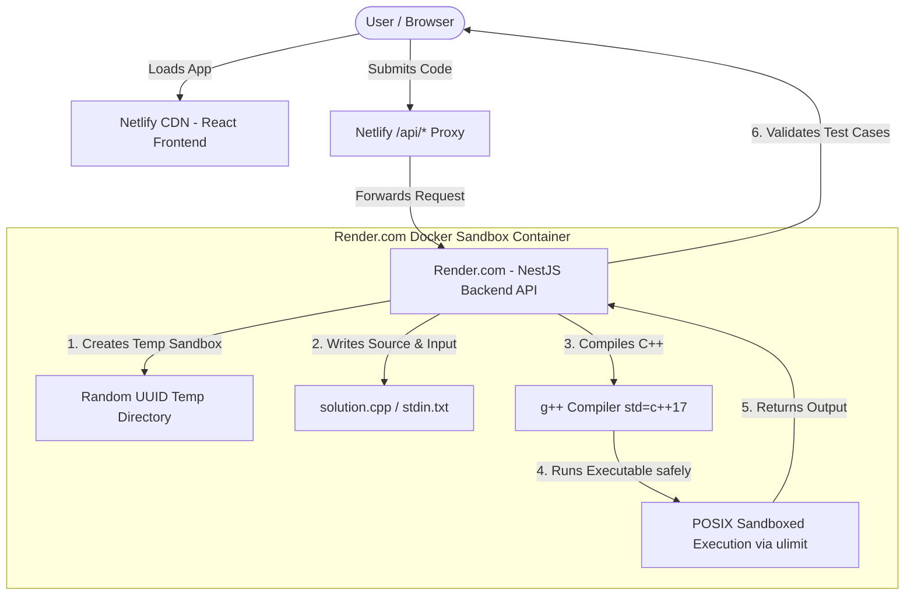

# 🧛 CodeVamp - High Performance, Zero-API Coding Platform

**CodeVamp** is an elite, next-generation competitive programming platform designed for speed, visual beauty, and ultimate developer experience. Engineered to run completely **cost-free and API-independent**, CodeVamp eliminates expensive third-party compilation APIs with a high-performance, secure **Zero-API Native Execution Engine** featuring native POSIX sandboxing.

### 🌐 Live Platform URL: [https://codevamp-coding-platform.netlify.app/](https://codevamp-coding-platform.netlify.app/)

---

## 🚀 The Hybrid Production Architecture (How We Solved the Compiler Challenge)

Competitive programming platforms require executing untrusted user code (in C++, Python, Java, etc.) natively in a secure, sandboxed compiler environment. Traditionally, this requires costly third-party execution APIs. CodeVamp runs **entirely natively and cost-free** by utilizing a unique hybrid architecture.



### 🧠 Why Serverless alone fails for Compilers (The Netlify Constraint)
When deploying a monorepo to serverless platforms like Netlify Functions (which runs on AWS Lambda), the environment is read-only, ephemeral, and **Node.js-only**. 
* AWS Lambda **does not have standard compiler toolchains** like `g++` (C++), `python3`, `javac` (Java), or `go` installed. 
* Any attempt to run a local compiler directly on a serverless platform results in a `g++: command not found` compilation error.

### ⚡ The CodeVamp Solution: Hybrid Infrastructure
To achieve a completely **cost-free, self-contained native execution environment** without paying for third-party sandboxes, we split the platform:
1. **Frontend (React.js)**: Deployed to **Netlify** for blazing-fast, edge-optimized global static asset delivery.
2. **Backend (NestJS API & Sandbox Engine)**: Deployed to **Render.com** as a persistent, containerized **Docker Web Service**.
3. **Netlify API Proxy**: Configured a seamless proxy redirect in Netlify (`/api/*` forwarding directly to the Render API). The frontend makes clean relative calls (`/api/submissions/execute`), entirely bypassing **CORS limitations** and keeping cookies/headers secure!

---

## 🛡️ Sandbox Execution & Security Architecture

The local code execution flow in `ExecutionService` is designed to be highly secure and completely sandboxed:

1. **Strict Language Whitelisting**: Only vetted runtimes (`python`, `cpp`, `javascript`, `java`, `go`) are permitted.
2. **Input Isolation (Safe Stdin Redirection)**:
   * To prevent command and shell injection vectors, user code and test case inputs are never passed directly to shell arguments.
   * A dynamic, random-UUID sandbox directory is provisioned (`/tmp/codevamp-exec/<uuid>`).
   * The user's code is written to `solution.cpp` and test case input is written to `stdin.txt`.
   * The program is executed strictly using file redirection: `./solution < stdin.txt`.
3. **Native POSIX Resource Limits**:
   * To protect the host server from malicious scripts (like fork bombs, memory leaks, or infinite loops), every run command is prepended with standard POSIX resource limit configurations:
     ```bash
     ulimit -t 10 -v 262144 2>/dev/null;
     ```
   * **`-t 10`**: Restricts maximum CPU execution time to 10 seconds.
   * **`-v 262144`**: Restricts maximum virtual memory to 256MB.
4. **Automated Cleanup**: Sandbox directories are forcefully deleted in a `finally` block, ensuring zero residue or disk leakage.

---

## 📦 Containerization & Build System

The backend is built inside a custom, highly optimized **Debian Bullseye Slim** container ([apps/api/Dockerfile](file:///Users/atuljoshi/Documents/Projects/CodeVamp%20Coding%20Platform/apps/api/Dockerfile)) which houses all compilers out-of-the-box:

```dockerfile
FROM node:18-bullseye-slim

# Avoid prompt blockages
ENV DEBIAN_FRONTEND=noninteractive

# Install all compiler toolchains directly inside the container
RUN apt-get update && apt-get install -y --no-install-recommends \
    build-essential \
    gcc \
    g++ \
    python3 \
    openjdk-17-jdk-headless \
    golang-go \
    && rm -rf /var/lib/apt/lists/*
```
When this Docker container boots on Render, it guarantees that `g++` and other runtimes are present and working 24/7, with no installation required on the client machine!

---

## 📊 Elite LeetCode-Style Profile Features

* **365-Day Activity Heatmap**: Fully interactive submission heat calendar, showing month groupings, activity grades, current and max streaks, and detailed popover tooltips.
* **SVG Radial Stats Indicator**: Concentric circular progress meters showing problems solved against total, categorized into Easy, Medium, and Hard tiers.
* **HexBadge Achievements System**: Beautifully animated achievement badges (e.g. *Knight of Code*, *Grandmaster*) built using CSS clip-paths and premium 3D hover animations.
* **Simulated Rating Trajectory Widget**: Displays rating progress over simulated contests with sleek custom SVG sparklines.

---

## 🛠️ Local Development & Setup

### 1. Install Compilers
To test native compilers locally, ensure your host computer has the runtimes installed:
* **Mac**: `brew install gcc openjdk go node` (or standard Xcode Command Line Tools)
* **Linux**: `sudo apt install build-essential python3 openjdk-17-jdk golang-go nodejs`

### 2. Boot the Monorepo
```bash
# Install all dependencies across workspaces
npm install

# Start NestJS backend locally on port 3000 (Seeds 15 problems automatically!)
npm run dev:api

# Start React Frontend locally on port 5173
npm run dev:web
```

---

## ☁️ Production Deployment Configuration

### 1. Backend (Render.com Web Service)
1. Create a **New Web Service** and connect your repository.
2. Configure Settings:
   * **Root Directory**: `apps/api`
   * **Runtime**: `Docker`
   * **Dockerfile Path**: `Dockerfile`
3. Add Environment Variables (Advanced):
   * `PORT`: `3000`
   * `NODE_ENV`: `production`
   * `JWT_SECRET`: `your-secure-jwt-key`
   * `MONGODB_URI`: `your-mongodb-atlas-connection-string`
   * `REDIS_HOST`, `REDIS_PORT`, `REDIS_PASSWORD` (Upstash configuration)

### 2. Frontend (Netlify)
1. Connect your repository to Netlify.
2. Netlify reads the updated [netlify.toml](file:///Users/atuljoshi/Documents/Projects/CodeVamp%20Coding%20Platform/netlify.toml) automatically:
   * **Build Command**: `npm install --include=dev && npm run build:web`
   * **Publish Directory**: `apps/web/dist`
3. Add a single Environment Variable in Netlify UI:
   * `VITE_API_URL`: `/api` *(This leverages the Netlify reverse proxy straight to your Render backend!)*

---

## 🤝 Contact & Developer Credentials

**Made with ❤️ by [Atul Joshi](https://github.com/AtulJoshi1206)**

Founder & Lead Software Architect of **CodeVamp**.
