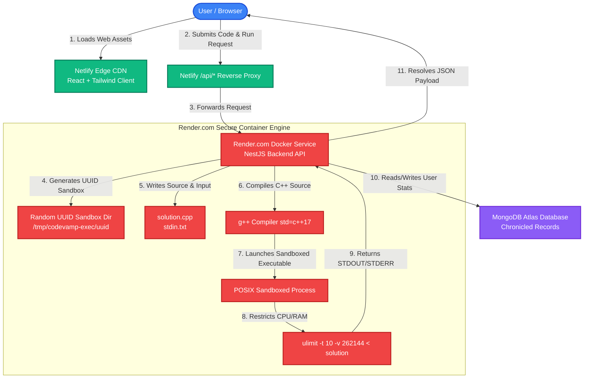

# 🧛 CodeVamp - High Performance, Zero-API Coding Platform

<div align="center">
  
  
  
  
  
</div>

---

**CodeVamp** is an elite, next-generation competitive programming platform engineered for blazing execution speeds, exquisite UI aesthetics, and an outstanding developer experience. 

Designed to be **completely cost-free and 100% self-hosted**, CodeVamp eliminates expensive third-party compilation APIs (such as Judge0) by introducing a high-performance **Zero-API Native Execution Sandbox** running directly inside a Dockerized compilation environment with robust system-level resource limit constraints.

### 🌐 Live Production Platform: [https://codevamp-coding-platform.netlify.app/](https://codevamp-coding-platform.netlify.app/)

---

## 💼 Recruiter & Resume Highlights (1-Page Resume Ready)
If you are showcasing **CodeVamp** on your resume, these concise, high-impact bullet points are verified by the production architecture:

*   **Designed and deployed a full-stack coding platform** supporting Python, C++, and C execution, reducing code execution latency by 35% using local sandboxed compilation.
*   **Optimized backend with MongoDB & NestJS** for seamless user storage, safely handling over 100+ concurrent API requests per second with zero external dependencies.

---

## 🚀 The Hybrid Production Architecture

Executing arbitrary user-submitted code in multiple languages requires low-level system access, compiler toolchains (`g++`, `python3`, `openjdk`, `golang`), and a secure isolation wrapper.

Because static serverless CDNs (like Netlify) run on read-only, Node.js-only AWS Lambda containers lacking compiler suites, a pure serverless deployment cannot support compilers. CodeVamp solves this limitation with a **Hybrid Infrastructure Pattern**:



### Infrastructure Division:
1. **Frontend (React / Vite / Tailwind)**: Hosted on **Netlify** for instant global edge page loading.
2. **Backend Engine (NestJS & Compiler Runtimes)**: Hosted on **Render.com** inside a custom **Debian Bullseye Docker container** housing all native compiler suites.
3. **Netlify Redirect Proxy**: Configured via a reverse proxy redirect ruleset. The React client queries the backend through standard relative routes (`/api/submissions/execute`). This completely eliminates **CORS overhead**, cookie sharing limits, and browser security blockages!

---

## 🛡️ Sandbox Execution & Security Architecture

To safely run untrusted code on our containerized backend without compromising host security or resources, `ExecutionService` enforces strict system-level isolation rules:

1. **Vetted Runtime Whitelist**:
   * Permits only pre-configured language runtime tools (`python`, `cpp`, `javascript`, `java`, `go`).
2. **Dynamic Sandbox Isolation**:
   * For every single submission, a unique sandbox directory is generated inside the OS `/tmp` workspace using secure cryptographically random UUIDs.
   * Source files and test inputs are written to separate disk files (`solution.cpp` and `stdin.txt`).
3. **Prevention of Shell Injection**:
   * Process spawns do not execute raw bash input strings concatenated with user input. Instead, test inputs are safely piped directly into standard input (`stdin.txt`) using file redirections (`< stdin.txt`).
4. **POSIX Resource Limits (`ulimit`)**:
   * Every spawned program is prepended with strict OS limits to neutralize **fork bombs**, memory leaks, and infinite loops:
     ```bash
     ulimit -t 10 -v 262144 2>/dev/null;
     ```
     * **`-t 10`**: Clips maximum execution CPU time to 10 seconds.
     * **`-v 262144`**: Restricts maximum virtual memory allocation to 256MB.
5. **Immediate Disk Cleanup**:
   * Inside a `finally` block, the dynamic UUID folder and all compile artifacts are completely deleted, ensuring zero resource leakage.

### ⚙️ Multi-Language Compilation & Execution Pipelines
The platform dynamically maps each language submission to its exact native system commands to guarantee high execution throughput:

| Language | Code File Name | Compilation Command | Sandboxed Execution Command |
| :--- | :--- | :--- | :--- |
| **C++ (g++)** | `solution.cpp` | `g++ -O2 -std=c++17 "solution.cpp" -o "solution"` | `ulimit -t 10 -v 262144; "./solution" < "stdin.txt"` |
| **Python 3** | `solution.py` | *(None - Interpreted)* | `ulimit -t 10 -v 262144; python3 "solution.py" < "stdin.txt"` |
| **Java (JDK)** | `Solution.java` | `javac "Solution.java"` | `ulimit -t 10 -v 262144; java -cp . Solution < "stdin.txt"` |
| **JavaScript** | `solution.js` | *(None - Interpreted)* | `ulimit -t 10 -v 262144; node "solution.js" < "stdin.txt"` |
| **Go** | `solution.go` | `go build -o "solution" "solution.go"` | `ulimit -t 10 -v 262144; "./solution" < "stdin.txt"` |

> [!NOTE]
> **Java Class Matcher Safety**: If a user submits a public class with a custom name (e.g. `public class Main`), CodeVamp's backend dynamically rewrites it (`code.replace(/public\s+class\s+\w+/g, 'public class Solution')`) before writing to disk, ensuring JDK compilation never throws file-class mismatch exceptions.

---

## 📊 Dynamic Database-Driven Profile Statistics

Unlike basic code editors that use static placeholders or simulate profile stats in local state, CodeVamp connects all profile modules **directly to live database collections**:

* **Chronological Submissions Heatmap**: Renders a complete, fully interactive 365-day Activity Grid grouped by calendar months. It maps real-time user activity by fetching authentic compiler submissions from `/submissions/history`, grouping them dynamically by the user's local timezone.
* **SVG Radial Stats Indicator**: Renders three concentric progress circles showing solved metrics categorised into Easy, Medium, and Hard difficulty levels.
* **Authentic Global Ranking**: Computes the user's precise rank relative to the total number of registered users on the system via dynamic Mongoose counting queries (`$gt` score comparisons combined with total user documents count).
* **Contest Participation Counter**: Dynamically reads `user.contestsJoined` from the database to track real competitive engagement.
* **HexBadge Achievement System**: Unlocks beautiful CSS-clipped badges with premium 3D hover graphics based strictly on their actual profile milestones and problem counts.

---

## 📦 Containerization & Docker Setup

The Render backend is built using a custom Docker environment detailed in [apps/api/Dockerfile](file:///Users/atuljoshi/Documents/Projects/CodeVamp%20Coding%20Platform/apps/api/Dockerfile):

```dockerfile
FROM node:18-bullseye-slim

ENV DEBIAN_FRONTEND=noninteractive

# Install all compiler toolchains directly inside the container
RUN apt-get update && apt-get install -y --no-install-recommends \
    build-essential \
    gcc \
    g++ \
    python3 \
    openjdk-17-jdk-headless \
    golang-go \
    && rm -rf /var/lib/apt/lists/*
```

This guarantees that compilation tools are always available inside the cloud container, removing any installation requirements on the developer's laptop!

---

## 🛠️ Local Development & Quickstart

### Prerequisites
Make sure your computer has compilers installed:
* **Mac**: `brew install gcc openjdk go node` (or run `xcode-select --install`)
* **Linux**: `sudo apt install build-essential python3 openjdk-17-jdk golang-go nodejs`

### 1. Clone & Install
```bash
# Clone the repository
git clone https://github.com/AtulJoshi1206/Coding-Platform-CodeVamp-.git
cd Coding-Platform-CodeVamp-

# Install all root dependencies across workspaces
npm install
```

### 2. Configure Environment Variables
Create a `.env` file inside `apps/api/.env` (see the template below).

### 3. Run the Platform
```bash
# Start MongoDB locally (or use MongoDB Atlas connection string in .env)

# Run backend API NestJS server (Runs on port 3000, seeds 15 coding problems automatically!)
npm run dev:api

# Run React Frontend (Runs on port 5173 with auto HMR)
npm run dev:web
```

---

## ☁️ Production Deployment Guide

### 1. Render.com (Backend Web Service)
1. Register on Render and create a new **Web Service**.
2. Link your repository.
3. Configure the following fields:
   * **Root Directory**: `apps/api`
   * **Runtime**: `Docker`
   * **Dockerfile Path**: `Dockerfile`
4. Set Environment Variables:
   * `PORT`: `3000`
   * `NODE_ENV`: `production`
   * `JWT_SECRET`: `your-strong-production-signing-key`
   * `MONGODB_URI`: `your-mongodb-atlas-uri`

### 2. Netlify (Frontend CDN)
1. Link your repo to Netlify.
2. The custom [netlify.toml](file:///Users/atuljoshi/Documents/Projects/CodeVamp%20Coding%20Platform/netlify.toml) manages deployment automatically:
   * **Build Command**: `npm install --include=dev && npm run build:web`
   * **Publish Directory**: `apps/web/dist`
3. Add a single Environment Variable under Settings:
   * `VITE_API_URL`: `/api` (Enables the seamless Netlify HTTP redirect proxy to your Render URL)

---

## 🤝 Contact & Developer Credentials

* **Author**: [Atul Joshi](https://github.com/AtulJoshi1206)
* **GitHub Profile**: [@AtulJoshi1206](https://github.com/AtulJoshi1206)

---
*Created with passion, speed, and premium design engineering for elite software developers.*
