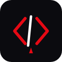

# 🧛 CodeVamp - High Performance, Zero-API Coding Platform

**CodeVamp** is an elite, next-generation competitive programming platform designed for speed, visual beauty, and ultimate developer experience. Engineered to run completely **cost-free and API-independent**, CodeVamp eliminates expensive third-party compilation APIs with a high-performance, secure **Zero-API Local Execution Engine** featuring native POSIX sandboxing.



---

## 🚀 Key Architectural Pillars

### ⚡ **Zero-API Native Compiler Engine**
*   **Local Multi-Language Compilers**: Supported languages run natively on the host system, featuring high-speed compilers and runners for **Python, C++, Java, JavaScript, and Go**.
*   **Parallel Execution**: Enforced test case checks run in parallel using high-speed async `Promise.all` workers, ensuring maximum throughput.
*   **Security & Redirection Sandbox**: Mitigates shell injection entirely by writing user source code and test inputs to secure, random-UUID temporary files and executing commands using **stdin redirection** (`cmd < stdin.txt`).
*   **POSIX Resource Limits**: Protects the server from malicious scripts (fork bombs, infinite loops, memory exhaustion) by executing runs with native `ulimit -t 10 -v 262144` constraints (10s CPU limit, 256MB virtual memory).

### 📊 **LeetCode-Style Profile Suite**
*   **Submissions Heatmap**: An authentic, interactive 365-day coding calendar displaying daily activity, month groupings, color grades, and current/max streak counters. Hovering over cells displays custom tooltip popovers.
*   **SVG Radial indicator**: Features concentric circular SVG progress rings rendering total problems solved out of total available, with dedicated progress bars for Easy, Medium, and Hard tiers.
*   **Sparkline Contest Widgets**: Shows simulated contest rating scales (1600+), bracket brackets, attendance count, and sleek SVG sparkline trajectory graphs over time.
*   **Skill Chip Tag Editor**: Allows direct in-page skills customization (adding/deleting skill chips) dynamically synced with the database.
*   **Hex Badge Achievements**: Displays gorgeous custom hexagonal shield badges representing platform milestones (e.g. *Grandmaster Solver*, *Knight of Code*) with premium 3D hover scale animations.

### 🛡️ **OWASP Top 10 Hardened Security**
*   **CORS Lockdown**: Wildcard CORS has been completely removed and restricted strictly to authorized origins and FRONTEND_URL environments.
*   **Mass Assignment Protection**: The profile updates are isolated using strict whitelisting (`bio`, `location`, `githubUrl`, `linkedInUrl`, `twitterUrl`, and `skills`), preventing parameter pollution and privilege escalation.
*   **NestJS Validation Pipe**: Enforces global request validation filters (`whitelist: true`, `forbidNonWhitelisted: true`) to automatically strip and reject unknown request properties.
*   **Credential Leak Prevention**: Queries dynamically strip and exclude the `password` hash field (`.select('-password')`) on all user fetches.
*   **Session Hardening**: JWT secrets are strictly gated (NestJS throws at boot if the key is missing) and token lifespans have been reduced from 7 days down to **24 hours** to restrict exploit windows.

### 🍃 **Zero-Dependency Development Database**
*   **Local MongoDB Memory Server**: CodeVamp automatically initializes an embedded, in-memory MongoDB binary upon local startup. Developers get a running local database out-of-the-box without installing MongoDB, running Docker, or configuring Cloud Atlas access!

---

## 🛠 Tech Stack

### **Frontend**
*   **Framework**: React.js (Vite)
*   **Styling**: Tailwind CSS (Minimal & Dark Premium)
*   **Animations**: Framer Motion
*   **Icons**: Lucide React & Custom SVG
*   **Hosting**: Netlify / Vercel

### **Backend**
*   **Framework**: NestJS (Monorepo architecture)
*   **Language**: TypeScript
*   **Database**: Embedded Local MongoDB (Dev) / MongoDB Atlas (Prod)
*   **Execution Sandbox**: Child Process Runner with POSIX limits

---

## 🚦 Local Development

CodeVamp is engineered to boot in seconds with **zero external dependencies**.

### 1. Prerequisite Compilers
Ensure you have compilers installed on your local host machine to test compiling languages:
*   **Python**: `python3`
*   **C++**: `g++` (supporting C++17)
*   **Java**: `javac` and `java`
*   **NodeJS**: `node` (preinstalled with NPM)
*   **Go**: `go`

### 2. Install Dependencies
Installs monorepo packages in workspaces:
```bash
npm run install:all
```

### 3. Environment Setup
Create a `.env` file in `apps/api/`:
```env
JWT_SECRET=any-secure-secret-key-of-your-choice
PORT=3000
```
*(No `MONGODB_URI` is required for development! CodeVamp automatically provisions and runs an embedded MongoDB Memory Server dynamically.)*

### 4. Run Services
Launch both servers simultaneously:
```bash
# Start NestJS backend (automatically seeds 15 coding problems on boot)
npm run dev:api

# Start React frontend on port 5173
npm run dev:web
```

---

## 🏗 Production Deployment

### 1. MongoDB Atlas
For persistent production storage, set up a MongoDB Atlas Cluster and make sure to configure Network Access to accept Netlify's dynamic IP range.

### 2. Environment Variables
Configure the following in your hosting provider's dashboard:
*   `MONGODB_URI`: Your production MongoDB Atlas connection string.
*   `JWT_SECRET`: A cryptographically strong secret token.
*   `NODE_ENV`: `production`

---

## 🤝 Contact & Credits

**Made with ❤️ by [Atul Joshi](https://github.com/AtulJoshi1206)**

Founder & Lead Developer of CodeVamp.
